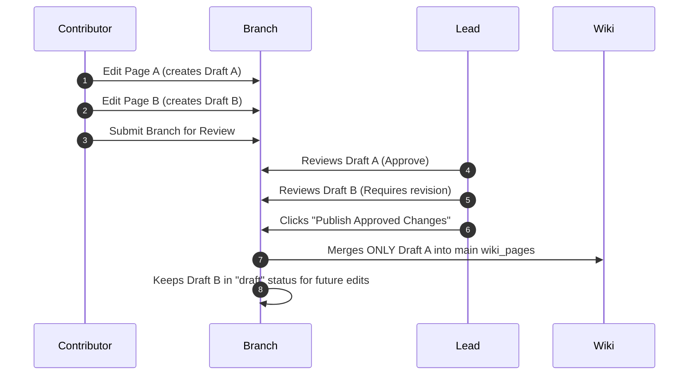

# Design: Arkon V2 Modular Architecture & Selective Branch Merging

This document defines the overall system refactoring phases, modular components, and the new selective merging protocol for Wiki Branching.

---

## 1. Stage-Based Ingestion Pipeline

The ingestion pipeline (currently tightly coupled inside `kb_service.py` and `worker.py`) is refactored into a **Pipes & Filters** pattern:

```
[Upload Request] ──> [Pipeline Orchestrator]
                            │
                            ├──> [1. FileExtractionStage] (via Parsers Registry)
                            ├──> [2. SemanticTriageStage] (AI classification/triage)
                            ├──> [3. Chunker & TOC Stage] (semantic pagination)
                            └──> [4. VectorizationStage] (embeddings generation)
```

### Stage Modularity:
*   **FileExtractionStage:** Employs the `ParserRegistry` to convert binary formats to Markdown.
*   **SemanticTriageStage:** Uses a small SLM/rule-engine to detect if the document is Junk or Transactional. Transactional/Junk files bypass the Wiki pipeline and are routed directly to keyword-only search, preventing Wiki index bloat.
*   **Tuning - Source Category Removal:** The `knowledge_type_id` (Category) is removed from `sources` database table. Only finalized `wiki_pages` are categorized for navigation.

---

## 2. Pluggable Parsers & MCP Plugins

### File Parsers Registry:
All file parsers are separated from the core pipeline logic and registered dynamically:
```python
class BaseParser(ABC):
    @abstractmethod
    def parse(self, file_bytes: bytes) -> str:
        pass

class ParserRegistry:
    _parsers = {}
    
    @classmethod
    def register(cls, mime_type: str, parser: BaseParser):
        cls._parsers[mime_type] = parser
```
Allows adding advanced parsers (e.g., LlamaParse, Azure Layout) simply by dropping a new parser class into the codebase.

### MCP Plugins Auto-Discovery:
Instead of declaring all tools in `app/mcp/tools.py`, a scanner automatically loads custom business tools at startup:
1.  Core Arkon tools reside in `app/mcp/tools.py`.
2.  Enterprise-specific integration tools are dropped into `app/mcp/custom_tools/`.
3.  The FastMCP server boots up, scans the directory, and registers all `@mcp.tool()` decorators dynamically, preventing git merge conflicts during upgrade cycles.

---

## 3. Wiki Branching & Selective Merging

To allow collaborative authoring while keeping the main Wiki index stable, we implement a Git-like branching strategy but allow **Selective Merging** (Cherry-pick approvals) at the page/draft level.

### Concept:
*   Instead of merging a whole branch (which might contain 3 complete pages and 1 half-written page), a branch is treated as a **Container of Proposed Changes (Drafts)**.
*   Each page modification inside a branch is saved as a `WikiPageDraft` containing a state (`draft`, `ready_for_review`, `approved`, `rejected`).

### How Selective Merging Works:



### Database Implementation of Selective Merge:
When performing the publish/merge action, the `WikiService` performs a selective query:
```python
# app/services/wiki_service.py

async def publish_approved_drafts_from_branch(db: AsyncSession, branch_id: uuid.UUID):
    # 1. Fetch only approved drafts from the branch
    approved_drafts = await db.execute(
        select(WikiPageDraft).where(
            WikiPageDraft.branch_id == branch_id,
            WikiPageDraft.status == "approved"
        )
    )
    
    for draft in approved_drafts.scalars().all():
        # 2. Upsert each approved draft into the live wiki_pages table
        await merge_draft_to_page(db, draft)
        
        # 3. Delete the draft from the branch or mark it as "merged"
        await db.delete(draft)
        
    # 4. Commit transaction
    await db.commit()
```
*   **Result:** Draft A is merged into `main` and vanishes from the branch workspace. Draft B remains in the branch in "needs_revision" status, allowing the contributor to edit and resubmit it without blocking the deployment of Draft A.
